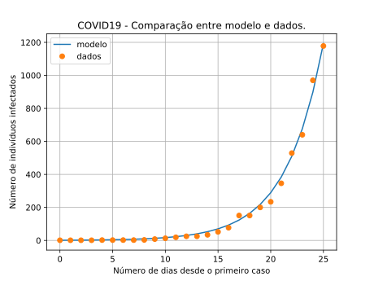
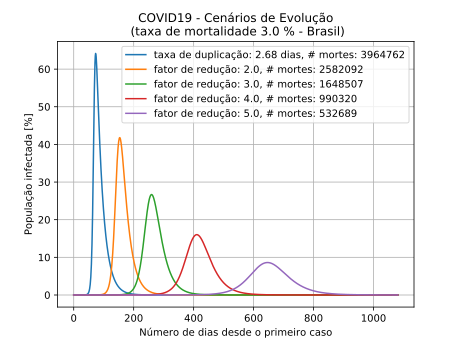

# covid19

## Model Calibration

### Calibration with data as of 2020-03-22 gives the following rates:
* a) doubles infected population average 2.68 days
* b) infected person takes 21.73 days to recover and become imune

## Sceneries

    --- cenário (parâmetros ajustados) ---
    nr. dias duplicação : 2.676600
    nr. dias doença     : 21.725800
    final de infectados : 64.15 %
    número de mortes    : 3964762
    dia de pico         : 73

    --- cenário (redução taxa de transmissão por fator 2) ---
    nr. dias duplicação : 5.353200
    nr. dias doença     : 21.725800
    final de infectados : 41.78 %
    número de mortes    : 2582092
    dia de pico         : 154

    --- cenário (redução taxa de transmissão por fator 3) ---
    nr. dias duplicação : 8.029800
    nr. dias doença     : 21.725800
    final de infectados : 26.67 %
    número de mortes    : 1648507
    dia de pico         : 260

    --- cenário (redução taxa de transmissão por fator 4) ---
    nr. dias duplicação : 10.706400
    nr. dias doença     : 21.725800
    final de infectados : 16.02 %
    número de mortes    : 990320
    dia de pico         : 411

    --- cenário (redução taxa de transmissão por fator 5) ---
    nr. dias duplicação : 13.383000
    nr. dias doença     : 21.725800
    final de infectados : 8.62 %
    número de mortes    : 532689
    dia de pico         : 646
